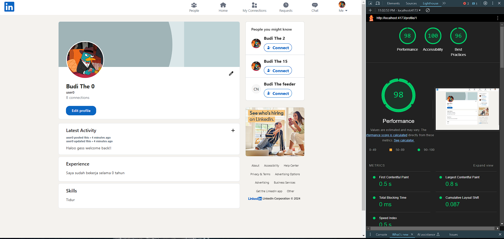
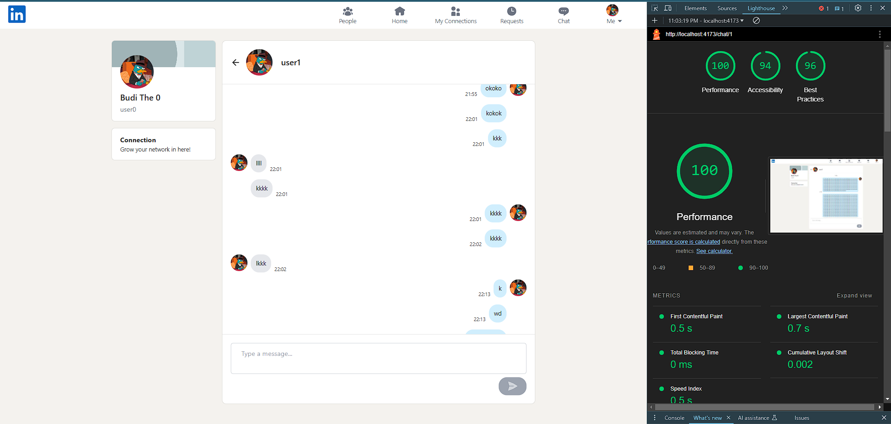

# Tugas Besar 1 - Pengembangan Aplikasi Berbasis Web

<br/>

## **Deksripsi Web App - Web App Description**

LinkinPurry adalah platform inovatif yang dirancang khusus untuk menghubungkan para agen O.W.C.A. dengan sesama agen untuk berbagi informasi. Seperti LinkedIn, aplikasi ini berfungsi bagi para agen untuk berbagi feed berita, menghubungkan dengan agen lain, dan mengirim pesan secara langsung dengan keamanan yang terjamin. Dengan tampilan yang ramah pengguna dan fitur yang kaya, LinkinPurry bertujuan untuk mempermudah para agen agar senantiasa terhubung satu lain dalam menjalankan misi mencari kerja.

## **Daftar Kebutuhan - Requirements List**

1. **Jenis Pengguna**:  
   Terdapat satu jenis pengguna job seeker.

2. **Autentikasi**:

   - Pengguna harus melakukan autentikasi untuk mengakses seluruh fitur, kecuali yang disebutkan untuk pengguna tidak terautentikasi.
   - Semua pengguna terautentikasi dapat melakukan logout.

3. **Pendaftaran**:  
   Pengguna dapat mendaftar sebagai job seeker.

5. **Fitur yang tersedia**:

   - Melihat daftar pengguna dan melihat profile pengguna
   - Melihat daftar koneksi dan membuat koneksi
   - Melihat daftar feed dari diri sendiri dan pengguna yang terhubung
   - Mengirim pesan pada pengguna yang sudah terhubung 
   - Mendapatkan notifikasi dari pengguna yang sudah terhubung

6. **Akses Pengguna Tidak Terautentikasi**:  
   Dapat melihat daftar pengguna, daftar koneksi, dan profile yang tersedia untuk publik, tetapi tidak dapat melakukan aksi lainnya.

## **Cara instalasi - How to Install **
1. Install npm
   - Buka situs resmi Node.js: https://nodejs.org - 
   - Ikuti petunjuk instalasi hingga selesai. Pastikan opsi untuk menambahkan Node.js ke PATH dicentang.

2. Install docker
   - Kunjungi situs resmi Docker: https://www.docker.com/products/docker-desktop.
   - Unduh installer Docker Desktop untuk Windows.
   - Ikuti petunjuk instalasi sampai selesai:

## **Cara Menjalankan Program - How to Run The Program**

1. Clone this repository

```sh
https://github.com/Labpro-21/if-3310-2024-2-k01-14.git
```

2. Change the current directory to `if-3310-2024-2-k01-14`

```sh
cd if-3310-2024-2-k01-14
```

3. Copy .env.example and change the name of the new copy to .env

4. Build and run your docker containers

```sh
docker compose up --build
```

5. Run in your localhost with port 5137

```sh
http://localhost:5137
```

## Dokumentasi API
```sh
Dokum
```

## Hasil Load Test
1. <strong>Load Test: Profil</strong><br/><br/><br/>
1. <strong>Load Test: Feed</strong><br/><br/><br/>

## **Screenshots of Application with Lighthouse**
1. <strong>Halaman Login</strong><br/><br/><br/>
2. <strong>Halaman Register</strong><br/><br/><br/>
3. <strong>Halaman Profil</strong><br/><br/><br/>
4. <strong>Halaman Feed</strong><br/><br/><br/>
5. <strong>Halaman Daftar Pengguna</strong><br/><br/><br/>
6. <strong>Halaman Permintaan Koneksi</strong><br/><br/><br/>
7. <strong>Halaman Daftar Koneksi</strong><br/><br/><br/>
8. <strong>Halaman Chat</strong><br/><br/><br/>
9. <strong>Halaman Landing</strong><br/><br/><br/>
10. <strong>Halaman Not Found</strong><br/><br/><br/>
11. <strong>Halaman Inbox</strong><br/><br/><br/>

## **Bonus yang dikerjakan**

1. UI/UX seperti LinkedIn
2. Connection recommendation
3. Typing Indicator
4. Google Lighthouse

## **Pembagian Kerja - Workload Breakdown**

**Anggota Kelompok**

| Nama            | NIM      | Panggilan |
| --------------- | -------- | --------- |
| Ignatius Jhon Hezkiel Chan | 13522029 | Kiel     |
| Imam Hanif Mulyarahman  | 13522030 | Imam     |
| Francesco Michael Kusuma   | 13522038 | Fransesco   |

**Server Side:**
| Fitur | Nim |
|----------------------|----------|
| Login, Logout        | 13522030 |
| Register             | 13522030 |
| Model User           | 13522030 |
| Model Connection     | 13522029 |
| Model Feed           | 13522030 |
| Model Notification   | 13522038 |
| Model Chat           | 13522029 |
| Service User         | 13522030 |
| Service Connection   | 13522029 |
| Service Feed         | 13522030 |
| Service Notification | 13522038 |
| Service Chat         | 13522029 |
| Controller User      | 13522030 |
| Controller Connection| 13522029 |
| Controller Feed      | 13522030 |
| Controller Notification | 13522038 |
| Controller Chat      | 13522029 |
| Middleware           | 13522029 |
| API Backend          | 13522029, 13522030, 13522038 |
| Setup Database       | 13522029 |

**Client Side:**
| Fitur | Nim |
|----------------------|----------|
| Halaman Login | 13522030 |
| Halaman Register | 13522030 |
| Halaman Profil | 13522038 |
| Halaman Feed | 13522030, 13522038 |
| Halaman Daftar Pengguna | 13522029 |
| Halaman Permintaan Koneksi | 13522029 |
| Halaman Daftar Koneksi | 13522029 |
| Halaman Chat | 13522029 |
| API Frontend | 13522029, 13522030, 13522038|